# ShoppyGlobe Backend API

## Overview

ShoppyGlobe Backend API is a RESTful backend application built using Node.js, Express.js, and MongoDB. It provides product management, shopping cart functionality, and secure user authentication using JSON Web Tokens (JWT).

## GitHub Repository

[ShoppyGlobe Backend](https://github.com/mayankrawat45/shoppyglobebackend)

## Features

* User Registration
* User Login with JWT Authentication
* Fetch All Products
* Fetch Product by ID
* Add Product to Cart
* Update Cart Item Quantity
* Remove Product from Cart
* Protected Cart Routes
* MongoDB Database Integration
* Error Handling and Validation

## Technologies Used

* Node.js
* Express.js
* MongoDB Atlas
* Mongoose
* JWT (JSON Web Token)
* bcryptjs
* dotenv
* CORS

## Project Structure

shoppyglobe-backend/
├── config/
├── controllers/
├── middleware/
├── models/
├── routes/
├── data/
├── .env
├── server.js
├── seed.js
└── package.json

## API Endpoints

### Authentication

POST /api/auth/register

POST /api/auth/login

### Products

GET /products

GET /products/:id

### Cart

POST /cart

PUT /cart/:id

DELETE /cart/:id

## Installation

1. Clone the repository

```bash
git clone https://github.com/mayankrawat45/shoppyglobebackend.git
```

2. Navigate to the project folder

```bash
cd shoppyglobe-backend
```

3. Install dependencies

```bash
npm install
```

4. Configure environment variables

Create a .env file and add:

```env
PORT=5000
MONGO_URI=your_mongodb_connection_string
JWT_SECRET=your_secret_key
```

5. Start the server

```bash
npm run dev
```

## Testing

The APIs were tested using Thunder Client/Postman.

## Screenshots

### MongoDB Products Collection
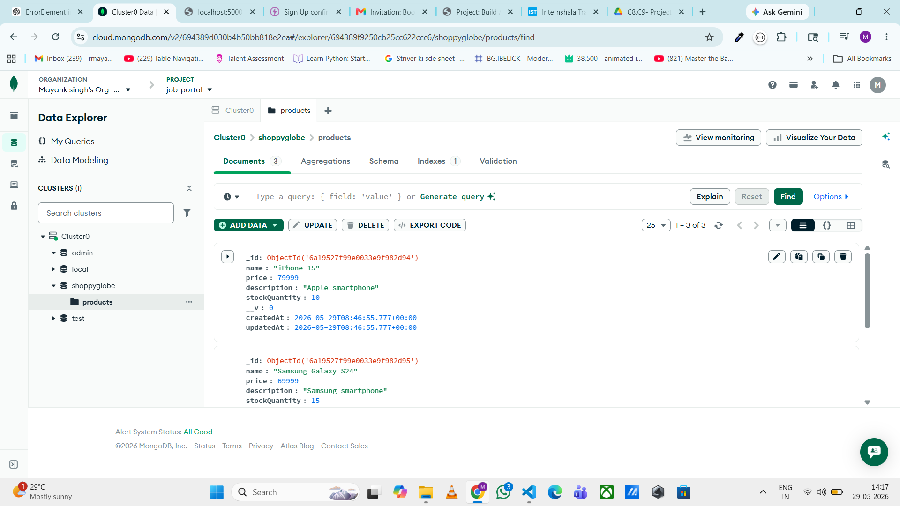

### MongoDB Users Collection
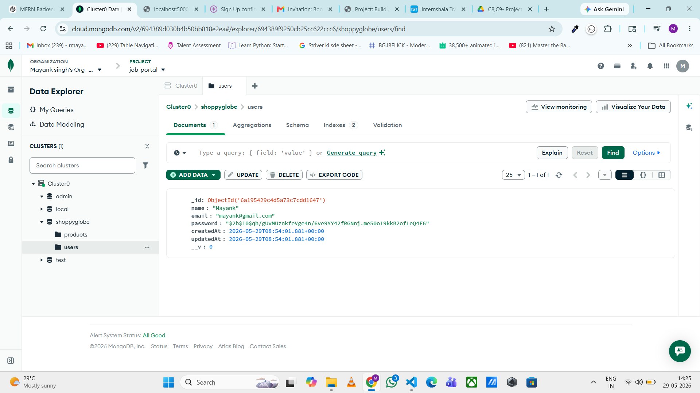

### MongoDB Cart Collection
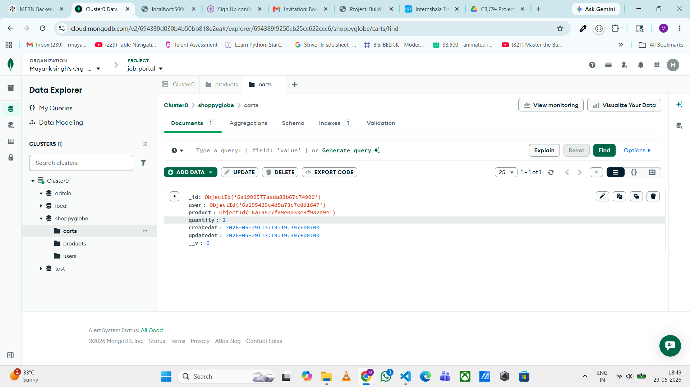

### Get All Products
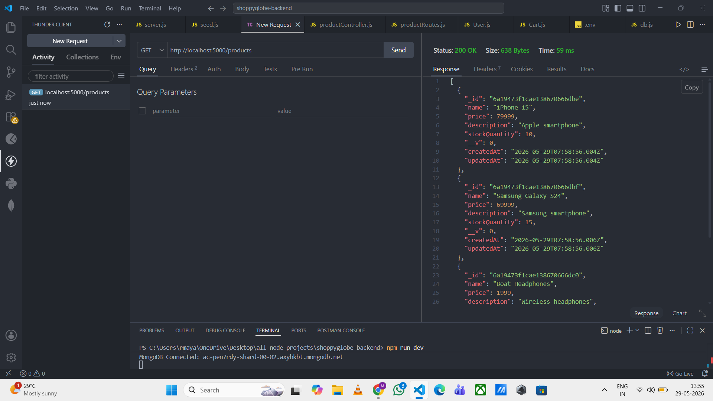

### Get Product By ID
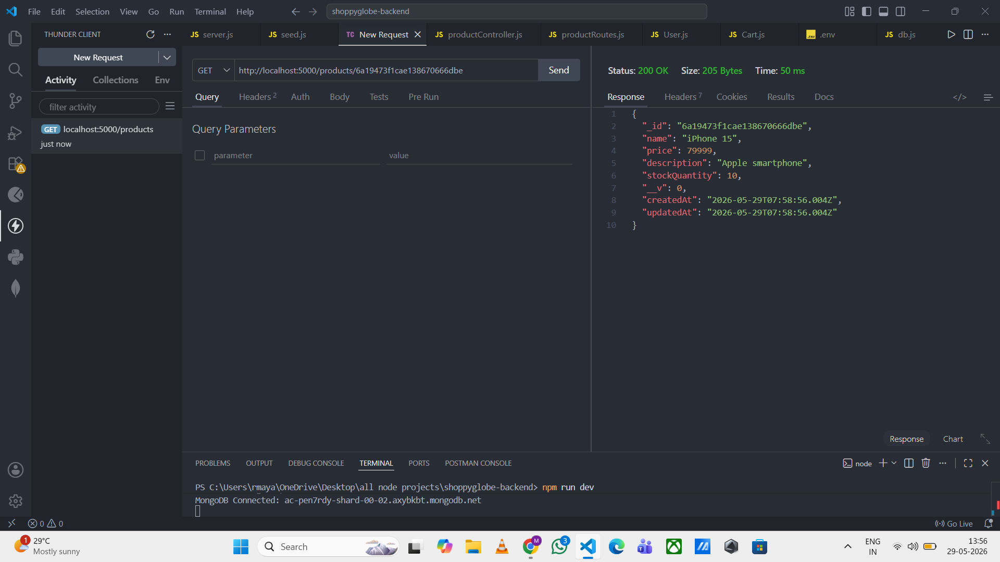

### User Registration
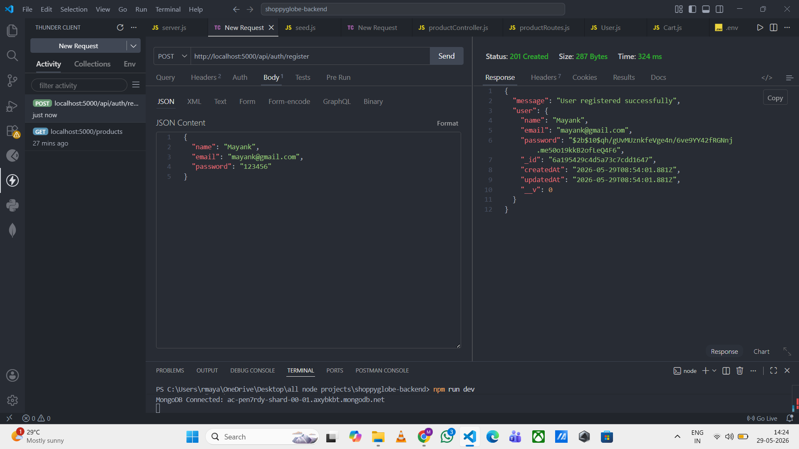

### User Login
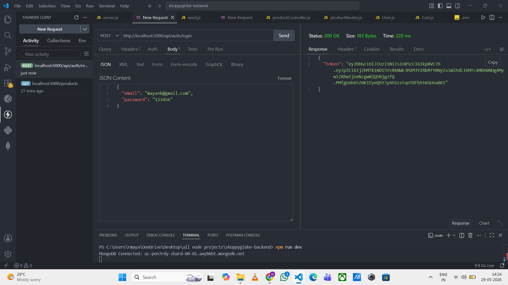

### Add To Cart
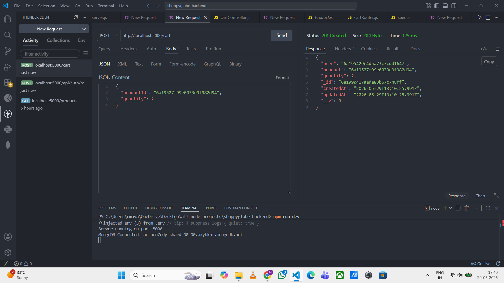

### Update Cart
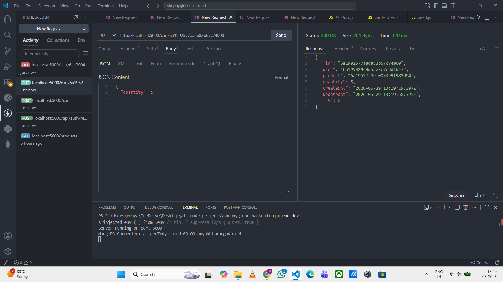

### Delete Cart
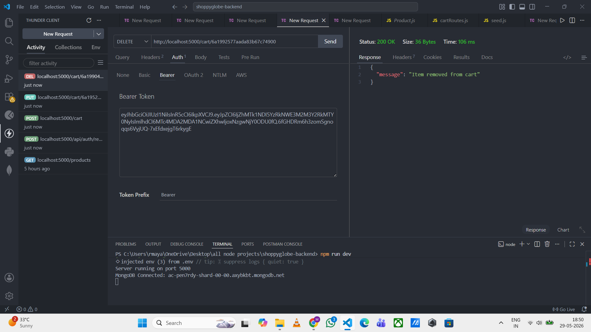

### Invalid Email Validation
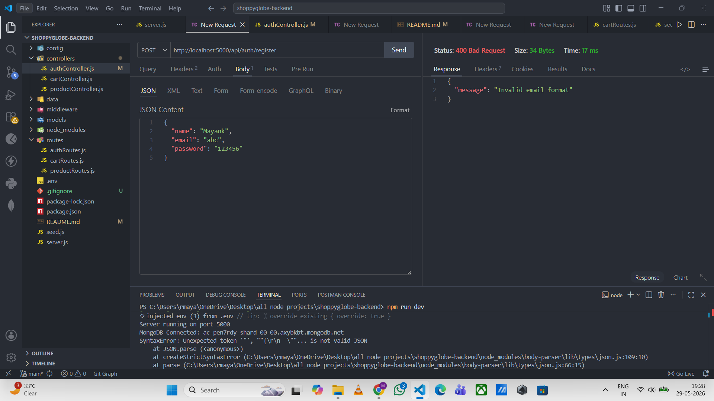

### Missing Fields Validation
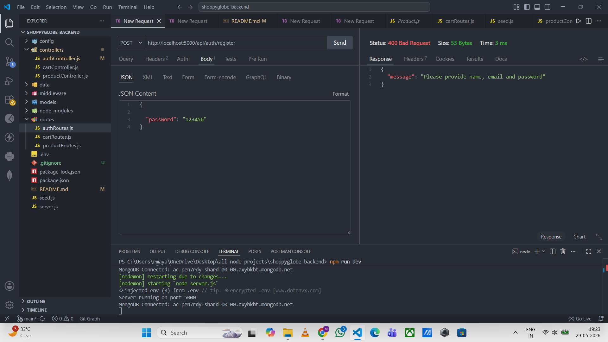

### Invalid Credentials
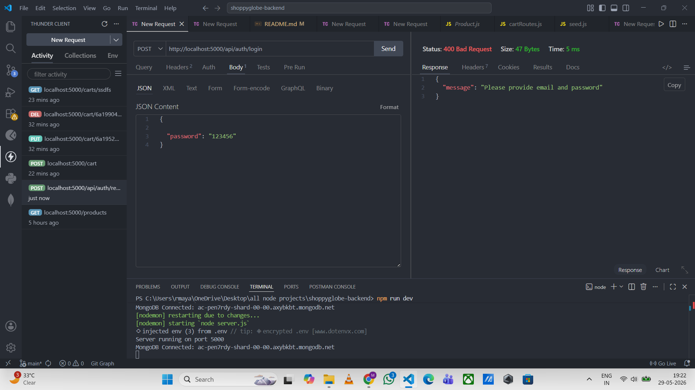

### Route Not Found (404)
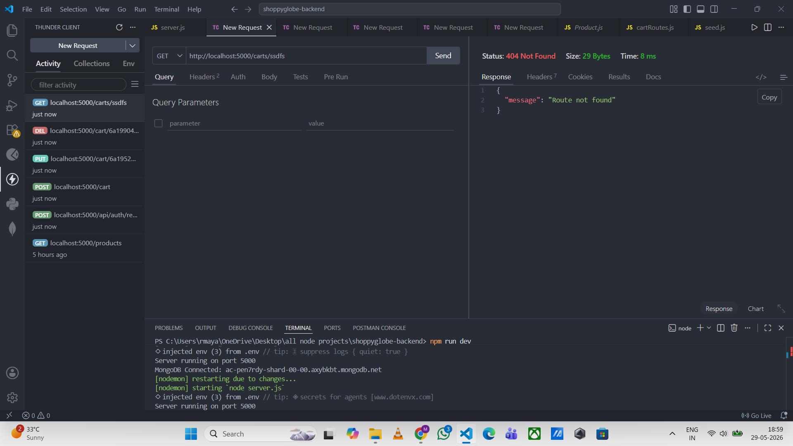

## Author

Mayank Singh Rawat